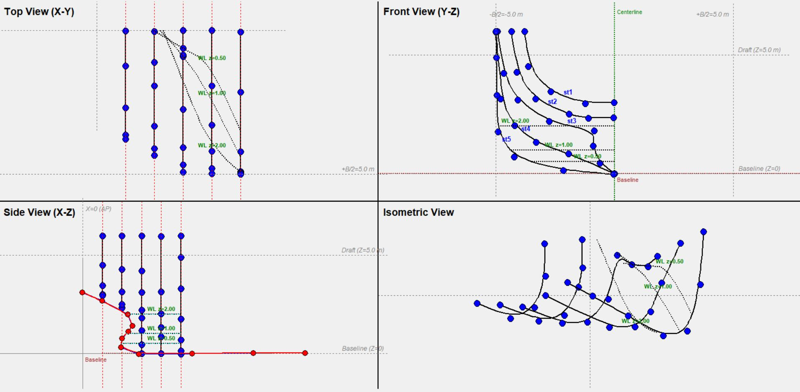
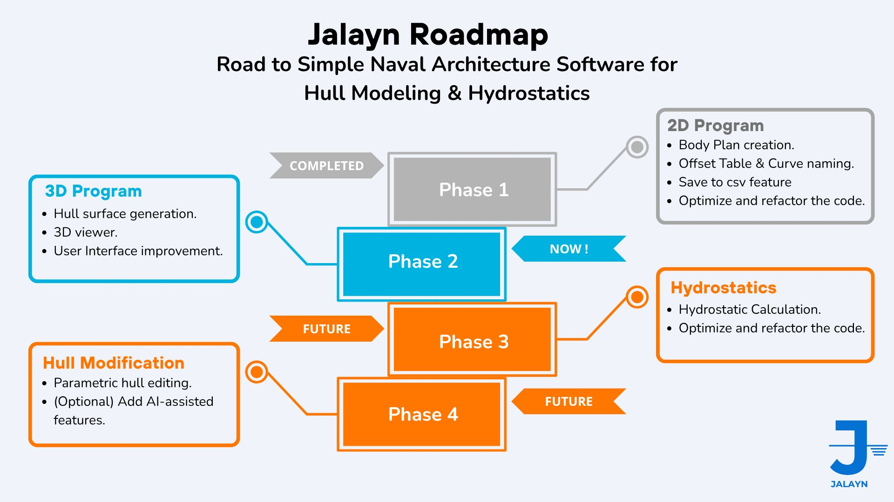
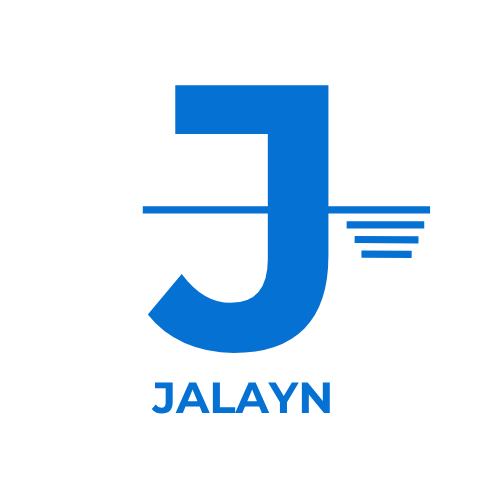

# JALAYN 
# Ver.02 

**JALAYN** is a personal experimental ship design tool built.  
It provides a simple interface for creating and managing ship body plans — including **stations**, **waterlines**, and **centerlines** — for hull form visualization and analysis.

This is a **personal learning project**, developed as part of my journey to improve my programming skills while combining them with my passion for **naval architecture**.  
I aim to keep improving and expanding JALAYN over time, making it as useful and accessible as possible for anyone interested in ship design.


## 🧭 Features Ver0.2 (UI/UX & 3D Improvement will be released in Ver0.3)

- Lines interpolation improvement
- Isometric View Pan & Drag
- 3D Preview using vispy
- Hide & Show Station
- Station coordinate editing using station list table
- .json save file


## 📂 Project Structure
Jalayn/
├── main.py
├── splash_screen.py
├── __init__.py
├── core/
│   ├── __init__.py
│   ├── bodyplan_app.py
│   ├── state_manager.py
│   ├── nurbs.py
│   ├── nurbs_curve.py
│   ├── geometry_nurbs.py
│   ├── viewer3d2.py
│
├── ui/
│   ├── __init__.py
│   ├── bodyplan_ui.py
│   ├── draw_canvas.py
│   ├── events.py
│   ├── menu_bar.py
│
├── assets/ 
│   ├── logo.png
│   ├── sample.csv
│   ├── splash.png
│   ├── preview.jpg            
│
├── README.md
├── requirements.txt
└── LICENSE


## 🚀 Run the Application
```bash
python main.py
```


🧩 Dependencies
All dependencies are listed in requirements.txt, but the main ones are:
- tkinter
- ttk
- vispy
- scipy
- numpy
- math, csv, copy, collections (standard Python libraries)


📜 License
This project is licensed under the Apache License 2.0.
You are free to use, modify, and distribute it — provided that proper credit is given to the original author:
© 2025 Zambilly Ahmad Washoya


🤝 Contributing
Contributions, suggestions, and improvements are welcome!


🧠 Design Philosophy
JALAYN is designed with **simplicity, freedom, and openness** at its core.  
The program focuses on being easy to understand and modify, encouraging creativity and learning rather than complexity.
As a **naval architect**, I created this project as a small contribution to the maritime and shipbuilding community —  
hoping it can inspire others to explore, learn, and build upon open-source ideas in naval design.


🌊 About the Name
The name comes from the Sanskrit word Jalayana, meaning “watercraft”, combined with “layn”, inspired by the word “line” — an essential element in ship design.
