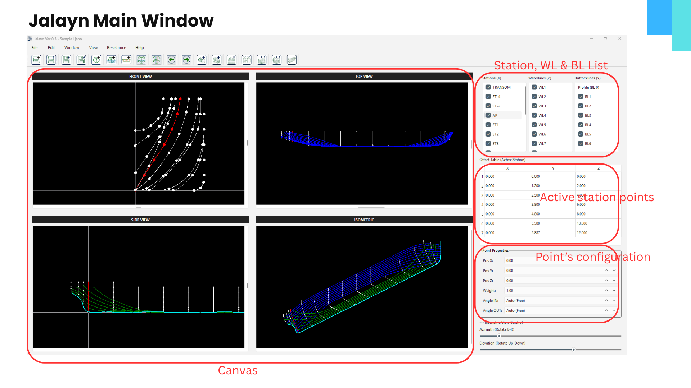
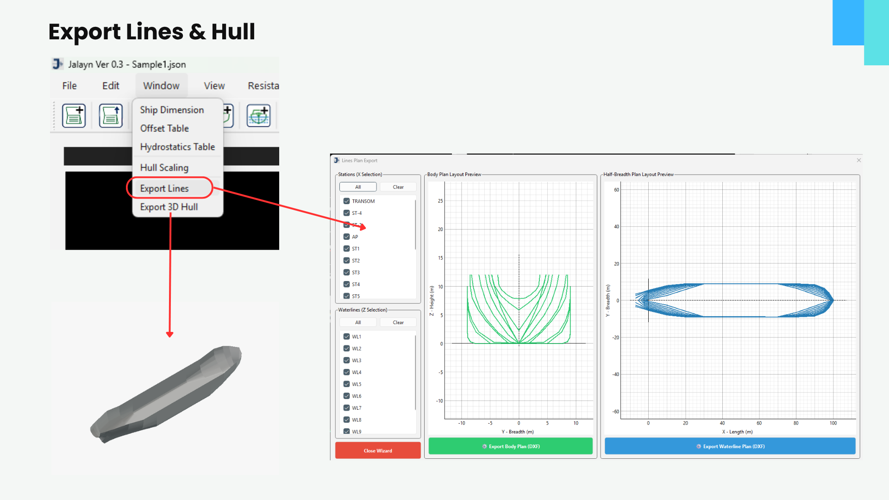

# JALAYN 
# Ver.03 

**JALAYN** is a personal experimental ship design tool built with python.
It provides a simple interface for creating and managing ship body plans — including **stations**, **waterlines**, and **buttocklines** — for hull form visualization and analysis.

This is a **personal learning project**, developed as part of my journey to improve my programming skills while combining them with my passion for **naval architecture**.  
I aim to keep improving and expanding JALAYN over time, making it as useful and accessible as possible for anyone interested in ship design.


## 🧭 Features Ver0.3 

- Lines interpolation improvement
- Effective Lines Drawing 
- 3D Preview 
- Offset Table
- Hydrostatic Calculation
- Resistance Calculation using Holtrop Mennen Method
- .json save file


## 🚀 Run the Application
We named the file as "training" since this project is to learn and develop Jalayn as a free software to help Naval Architect.
We also have two samples of lines inside the sample folder.

```bash
python training1.py
```


🧩 Dependencies
All dependencies are listed in requirements.txt, but the main ones are:
- PySide6>=6.5.0
- numpy>=1.24.0
- scipy>=1.10.0
- pyvista>=0.40.0
- pyqtgraph>=0.13.0
- geomdl>=5.3.0
- pythonocc-core>=7.7.0


📜 License
This project is licensed under the Apache License 2.0.
You are free to use, modify, and distribute it — provided that proper credit is given to the original author:
© 2026 Zambilly Ahmad Washoya


🤝 Contributing
Contributions, suggestions, and improvements are welcome!


🧠 Design Philosophy
JALAYN is designed with **simplicity, freedom, and openness** at its core.  
The program focuses on being easy to understand and modify, encouraging creativity and learning rather than complexity.
As a **naval architect**, I created this project as a small contribution to the maritime and shipbuilding community —  
hoping it can inspire others to explore, learn, and build upon open-source ideas in naval design.


🌊 About the Name
The name comes from the Sanskrit word Jalayana, meaning “watercraft”, combined with “layn”, inspired by the word “line” — an essential element in ship design.
